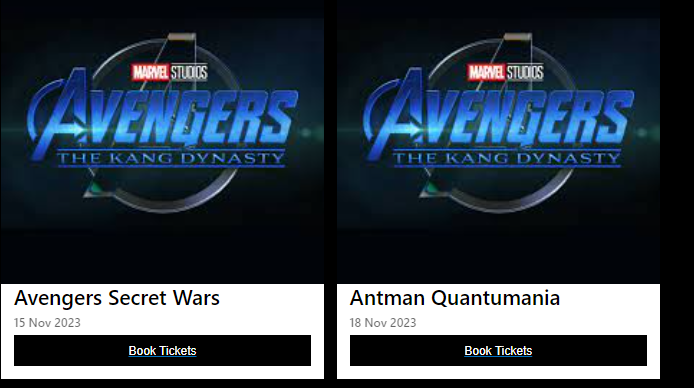

# Cinema Website

## this website is a website fo customers to book tickets online and can choose seats according to their convenience.

the website is hosted on azure cloud platform

https://cinema-app.azurewebsites.net/

// server opens sometimes

The website have just been developed and has only few features like register/buy tickets and login

the website is made with blazor server with .net c# as the backend handling the server and the databases.

The database used currently is firebase realtime database to keep data of the user profile and movie information whereas the user is authorize using firebase authentication 

## Sample Website Ui for now :

### Website page 

### Register page

### Login page

### movie that is coming next week

### User View after login *pretty much similar to the one before log in, for now*

